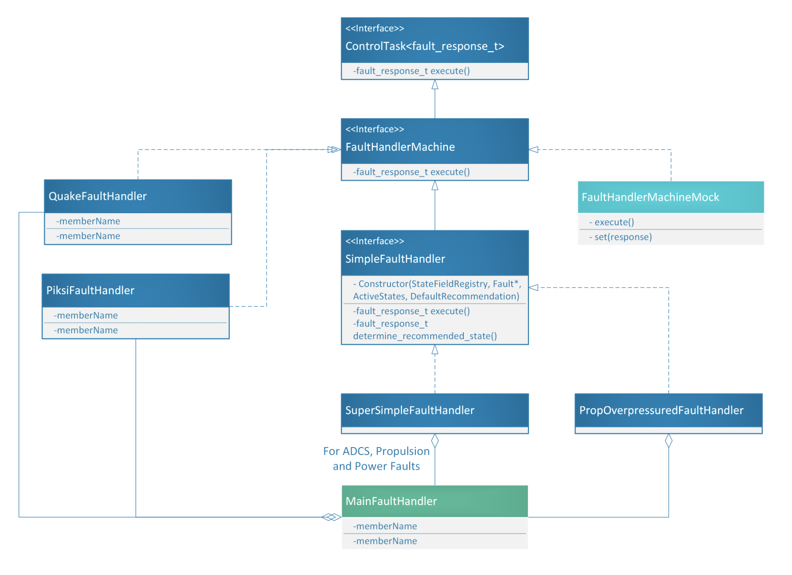

================
Fault Management
================
Fault management is a general term for what is actually three distinct functions: fault detection, fault isolation,
and fault response. Together, these three behaviors are known in the spacecraft industry as FDIR (fault detection, isolation
and response.) Our spacecraft is not very complex--we don't have multiple levels of subsystems--so we generally do 
not need to isolate root-level faults from their top-level diagnosis. Instead, we only participate in fault detection and
response, which I'll describe in greater detail below.

Fault Detection
----------------
We detect faults in two main ways: via state machines, and via the Fault class. State machine fault detection is used
for complex, tiered fault scenarios where a system is counted as "faulted" due to a history of different kinds of failures; see
Quake Fault Handler and Piksi Fault Handler below. But for the most part, we use the Fault class for simpler kinds of
failures such as wheel failures or critically low battery levels.

The fault class is just a wrapper around a boolean state field that creates a set of "control" state fields around the boolean
value. The boolean value can be signaled or unsignaled by control tasks; if the value is signaled a certain number of times, 
called the *persistence threshold*, the fault is said to be in a "faulted" state. Ground-controllable parameters can suppress
or force this "faulted" state, giving the ground full control over the effect of faults on flight software behavior.

For a fault whose base-level flag is called "x", it creates the following state fields:
TODO describe fault class flags

The following failures are surrounded by a fault class:

- HAVT-reported failures of the ADCS wheel ADCs
- HAVT-reported failure of the ADCS wheel potentiometer
- Critically low battery level
- Prop overpressure
- Prop failed-to-pressurize

For certain kinds of faults, there is not a single fault-detection-and-response event, but several in succession, each depending
on the previous detection. The Quake and Piksi fault responses have this property, and so they implement state machines for keeping
track of their fault state. I'll describe these now.

**Quake Fault Handler**

This handler exists to manage long durations of comms blackouts. The fault response can be described as follows:

- If there has been no comms with the Iridium satellite network for more than 24 hours, force an exit of the mission and Instead
  go into standby mode in order to be in a comms-maximizing attitude.

  Note that I said "comms with the Iridium satellite network" and *not* "comms with the ground." The motivation behind
  this fault handler is that lack of comms might be due to a pointing or a device failure; we should not punish the mission
  trajectory if its attitude has been unlucky enough that it can establish comms but not send a full downlink packet.

- If the satellite has been in standby due to the previously described fault response for more than 8 hours, trigger a powercycle
  of the radio. Repeat this fault detection and response up to three times before moving to the next fault response.

- If there continues to be a comms blackout, change the mission state to safehold. The goal with this fault response is to
  disable ADCS and force the satellite into a random, slow tumble, during which we might hope to get comms. This is useful since
  it's possible that a faulty pointing strategy or an erroneous attitude estimation causes a lack of comms in standby mode.

**Piksi Fault Handler**

This handler manages long durations during which we are unable to establish a real-time kinematic (RTK) GPS fixes. The fault
handler recommends moving the satellite to standby if any of the following three situations occur:

- If the Piksi has been unable to collect GPS data for a extended duration (i.e the Piksi is dead)

- If the satellite are in close approach, but the Piksi has been unable to get an RTK fix for a configurable wait period.

- If the satellites are in a close approach state and the Piksi has been able to get RTK fixes while in close approach, 
  but then the Piksi stops getting RTK fixes for a configurable wait period. 

Fault Response
--------------
The fault response to any fault consists in a change of mission state and a string of subsystem-specific actions. Either of these
values may be null; it may be that the response to a fault may recommend no change in mission state or no subsystem-specific actions.

The fault response is administered via a control task called `MainFaultHandler` contained within MissionManager. At a high level, what it
does is run a bunch of sub-tasks that each recommend a mission state to `MainFaultHandler` and run subsystem-specific actions. The
`MainFaultHandler` combines these recommended mission states into a single recommendation to the MissionManager, in the following priority:
- If safehold is recommended by any sub-fault handler, the `MainFaultHandler` recommends safehold
- Otherwise, if standby is recommended by any sub-fault handler, the `MainFaultHandler` recommends standby
- Otherwise, the `MainFaultHandler` makes no recommendation.

All fault response control tasks derive from a class called `FaultHandlerMachine`, whose inheritance diagram is shown below:

   Diagram depicting the fault handler machine classes.

The core of all of these tasks is that they return a `fault_response_t`, which has value either `none`, `standby`, or `safehold`,
corresponding to each possible recommended mission state by a fault handler. `QuakeFaultMachine` and `PiksiFaultMachine` implement
this interface along with an internal state machine to keep track of their fault state, as described above.  `MainFaultHandler` implements
this interface as well.

For responding to simple fault detections, such as those captured by the Fault class, we've created the `SimpleFaultHandler` interface.
It accepts a pointer to a Fault object, a set of mission states during which the fault handler responds to the fault (which we call *active states*),
and the fault handler's recommendation upon detecting a fault.

The `SimpleFaultHandler` is an interface because it leaves its execute() function undefined, choosing instead to implement a function
called `determine_recommended_state()`. This function produces the fault handler's recommended mission state as a function of the current
mission state, the fault handler's "active states", and the state of the fault object. Subclasses of `SimpleFaultHandler` implement subsystem-specific
actions in response to the fault. `SuperSimpleFaultHandler`, for example, implements no subsystem-specific response. `PropOverpressuredFaultHandler`,
on the other hand, is a specialization that causes the propulsion tank to vent its propellant in order to relieve the pressure.

As depicted, the MainFaultHandler contains a few `SuperSimpleFaultHandler`s (for ADCS, power, and propulsion failure-to-pressurize faults), a
`PropOverpressuredFaultHandler`, a `QuakeFaultHandler`, and a `PiksiFaultHandler`. It runs all of its sub-tasks in order to administer the satellite's
fault response.

For the purpose of unit testing, we also have a `FaultHandlerMachineMock` that a tester can use to manually inject any kind of recommended mission state.
It executes no subsystem-specific actions.
