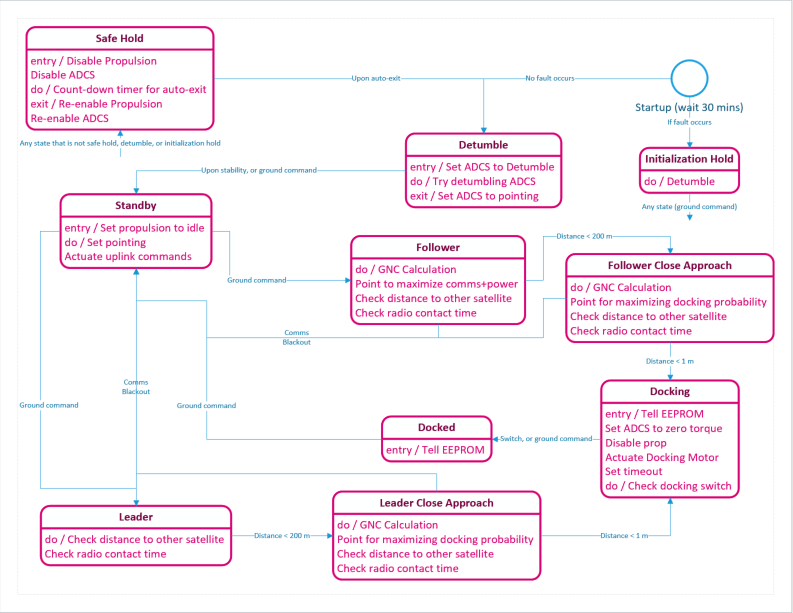

==================
Mission Management
==================

PAN has a very simple goal: dock two satellites together in space. The execution of this goal, though,
is made complex by way of fault management and contractual requirements. The `mission manager` software on
PAN handles these complexities, by way of the ``MissionManager`` control task (see _Components).
It contains the logic for the PAN Mission State Machine, which controls the overall pointing and orbital
maneuver strategy for the spacecraft, and addresses faults, startup, and reboot conditions.

Nominal Mission Management
==========================

   Diagram depicting the mission manager state transitions. This document is a little outdated, and
   the text below should be considered the source of truth, but it still is a generally accurate
   depiction of what happens in the spacecraft's mission modes.

The PAN Mission Manager contains the following states:

- The "nominal" states, which would be generic states that might be found on any satellite.

  - **Power up**: This is the first state that occurs upon initialization of the first control cycle.
    During this mode, each subsystem checks the state of its hardware devices, persistent boot values
    are pulled from EEPROM (see :doc:`subsystems/eeprom`), and the satellite waits for the end of the
    contractually-required 30-minute deployment period. It then determines the next mode, which is
    either "initialization hold" or "detumble".

  - **Initialization hold**: If something is wrong with the spacecraft that would impede its ability
    to make communications with the ground, this mode tries to get the satellite to stop tumbling
    and generally conserve power to maximize the probability of communication. Upon successful
    communication, the ground is free to command the satellite into any mode.

  - **Detumble**: During this mode the satellite is reducing its angular rate so that the attitude of the
    spacecraft is stabilized.

  - **Standby mode**: No GNC commands are made, and the PAN satellite is put into a power-maximizing
    orientation by default. A ground command can move the satellite into any state from this state,
    but the nominal choices are either the "follower" or the "leader" state.

- The "PAN-specific" states, which are very specific to the PAN mission.

  - **Follower**: During this state the satellite points itself to maximize comms + power,
    and executes propulsion manuevers that match its orbit and phase with the leader and satellite. The
    leader's position is continuously provided via ground uplink to the follower.

  - **Leader**: This state is the same as the follower state except that propulsion commands are disabled.

  - **Follower Close Approach**: During this state the satellite does the same things as in the "follower"
    state except it points towards the other satellite.

    Once the two satellites are fairly close together, they both move into the "Docking" state. This
    determination is dependent on the follower and leader satellites achieving CDGPS lock
    (see :doc:`subsystems/gps`).

  - **Leader Close Approach**: This state is the same as the leader close approach state except that
    propulsion commands are disabled.

  - **Docking**: The satellites drift towards each other passively (no propulsive or attitude guidance
    is applied), with the magnetic docking ports on the ends of the satellites causing the satellites
    to dock.
 
  - **Docked**: The satellites are joined together; this state is either autonomously entered by the
    pressing of the docking switch following the "Docking" state, or is a state entered via a ground
    command (i.e. the ground software notices that the satellites have been in the same position for
    a long time, and therefore must be docked.)

We can think of the PAN-specific mission states as having two distinct phases: the "active mission" phase,
consisting of the follower and leader states, and the "post mission" phase, consisting of the docking and
docked states. I'm making this distinction because the behavior of states in these two phases differs if 
the satellite powers down unexpectedly due to software faults or power faults. Namely, if the satellite
powers down during the active mission phase, then the entire mission is restarted from both satellites
being in standby, but if power down happens during the post-mission phase, then the satellite restarts
from its most recent mission state. This is achieved via saving the satellite state to EEPROM.

Setting Subsystem Behavior
==========================
The mission manager sets states and modes of the spacecraft subsystems to achieve its desired behavior.
See :doc:`states_and_modes` to understand the difference between states and modes.

Fault Management
================
Call Paul Blart, the Mall's Cop
TODO
