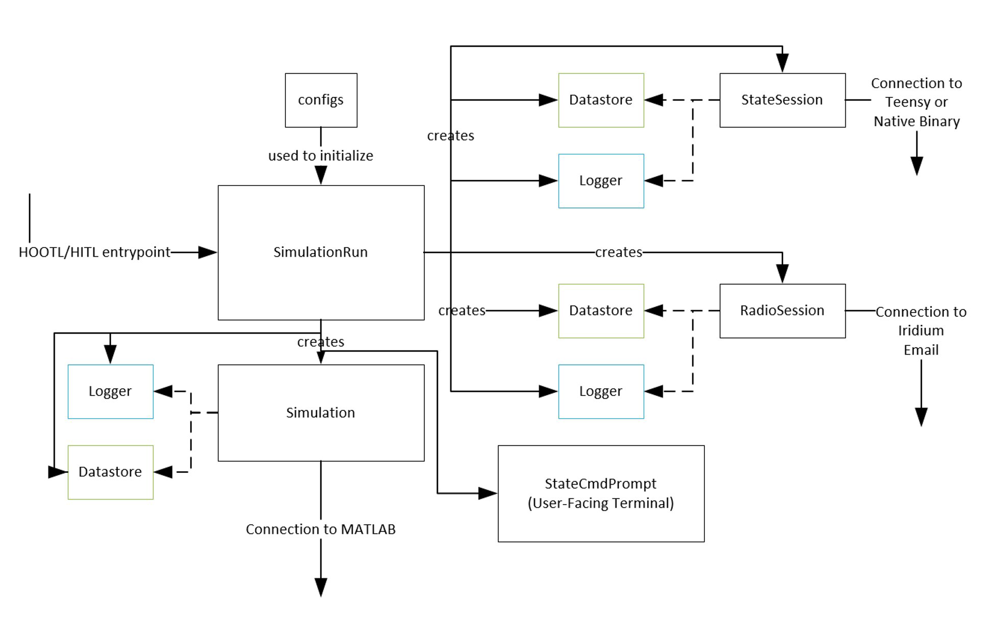

====================
PTest Software Stack
====================

At the core of the simulation architecture is the **StateSession**. This is an integration
class that either connects to a Teensy running flight software or to a desktop binary executable,
and allows exchanging state fields with the flight software.

Related to the **StateSession** is the **RadioSession**, which creates a connection to the
email account that PAN uses to talk to the Iridium satellite network. Using this email account,
the **RadioSession** is able to interpret downlinks and send uplinks when requested by the
simulation.

At the top level, the **SimulationRun** architects the **Simulation**, any **StateSession**
objects, any **RadioSession** objects, the **StateCmdPrompt**, and **Datastore** and **Logger**
objects required by the state sessions, simulation, and radio session.

The State Command Prompt
========================
This is a user-facing CLI that interacts with state session and simulation objects to produce
meaningful test behavior. The user has access to a wide selection of commands:

- ``rs`` and ``ws`` are used to **read state** fields and **write state** fields to a currently selected state session
  or radio session. ``wms`` can be used to write multiple state fields at a time.

  Typical usage is as follows:
  ::

      > rs pan.cycle_no
      1                                               (Completed in 604 us)
      > ws cycle.start true
      Succeeded                                       (Completed in 731 us)
      > wms pan.state 11 cycle.start true
      Succeeded                                       (Completed in 985 us)
      > rs pan.cycle_no
      3                                               (Completed in 651 us)

  You can find the actual implementation for these commands in ``StateSession`` and ``RadioSession``.

- ``cycle`` is shorthand for ``ws cycle.start`` (advancing the flight software cycle by 1) and ``cyclecount``
  is shorthand for ``rs pan.cycle_no``.
- ``plot [field]`` can be used to plot the values of a state field that have been collected so far.
- ``listcomp`` lists the set of available state and radio sessions to connect to.
- ``switchcomp`` can be used to switch between state and radio sessions.
- ``checkcomp`` lists the currently active state or radio session. Typical state/radio
  session choices include

  - ``FlightController``
  - ``FlightControllerRadio``
  - ``FlightControllerLeader``
  - ``FlightControllerLeaderRadio``
  - ``FlightControllerFollower``
  - ``FlightControllerFollowerRadio``

- ``checksim`` can be used to check how many seconds are left in the current simulation.
- ``endsim`` ends the MATLAB simulation (though this behavior has been a little flaky.)
- ``telem`` is used to extract the most recent telemetry packet off of the spacecraft.
- ``parsetelem`` parses the most recently received packets into a meaningful state.
- ``os [field]`` can be used to override the value of a state field on the current state session so that values sent
  by the simulation for that state field value are ignored.
- ``ro [field]`` releases the override on a field.

Useful Commands:

- ``ws cycle.auto true`` : `DebugTask` in flight software will no longer wait for ``cycle.start`` to be true before finishing,
  so Flight Software cycles will automatically proceed.

