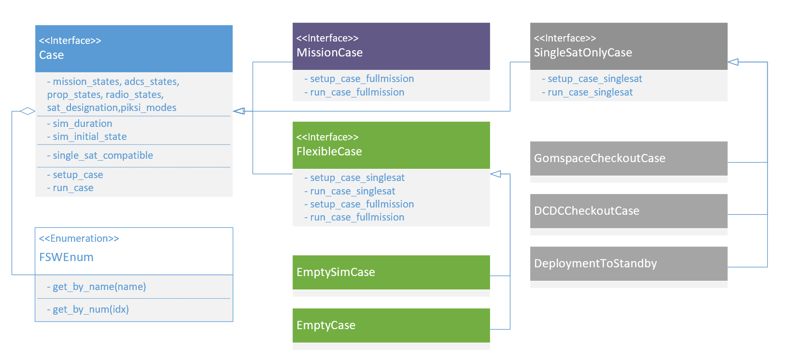

====================
PTest Cases
====================

Take a read at :doc:`testing_architecture` before looking at this page. Once you do, you know
that StateSession is the core of how a user interacts with flight software instances. The
state command prompt provides a manual way to read and write state from flight software; ptest
cases provide a powerful, Python-based, automated way to transact state fields. This allows
for the creation of automated simulations and testcases on our spacecraft.

See below for an inheritance diagram of the ptest case base classes:

   Diagram depicting the relationship between the base classes of ptest cases.

Writing a PTest Case
====================
Is as simple as inheriting from either ``SingleSatOnlyCase`` or ``MissionCase``, as diagrammed above.
These base classes contain some utilities for reading and writing state to either 1 or 2 satellites,
respectively. 

The base ptest class also exposees a set of `FSWEnum` objects which create dual-indexing of common
flight software enums (like mission state, ADCS state, etc.) by both name and numerical value.
See the example below of how you can set the satellite mission state to "manual".

Examples of writing a state field through a ptest case derived from ``SingleSatOnlyCase``:

| ``self.ws("pan.state", self.mission_states.get_by_name("manual"))``
| ``self.ws("dcdc.ADCSMotor_cmd", True)``
| ``self.ws("adcs_cmd.rwa_speed_cmd", [0,0,0])``

``self.ws()`` accepts the statefield name and a int, float, bool, or a list of them.

Examples of a reading state field through a ptest case derived from ``SingleSatOnlyCase``:

| ``self.rs("adcs_monitor.mag_vec")``
| ``self.rs("adcs_cmd.havt_reset0")``

| ``self.rs()`` returns the proper type of variable associated with each state field.
| ``self.rs("adcs_cmd.rwa_speed_cmd")`` returns a list of floats.

Listing of Ptest Cases
======================

ADCSCheckoutCase
----------------

The ADCSCheckoutCase

Initialization
##############

1. Sets the mission state to ``manual``
2. Sets the ADCS state to ``point_manual``
3. Set the RWA mode to ``RWA_SPEED_CTRL``
4. Set the intial RWA speed command to ``[0,0,0]``
5. Turn on the ADCS Motor DCDC.

HAVT Checkout
#############

The HAVT checkout begins by resetting all devices on the ADCSC.

It then pattern matches the read HAVT table with existing cataloged test-beds. If no match is found,
the user is alerted.

Then all devices are disabled and reset, to make sure the devices are all properly cycled,
and returned to the initially read HAVT table.

MAG Checkout
############

The checkout case pulls ten readings from the mag, ``cycle()`` ing the FC between each reading.
It checks to make sure the readings change over time, 
and that the magnitude of the readings are reasonable 
(within expected earth magnetic field strength expectations).

MAG Independence Checkout
#########################

If both magnetometers are functional, this test section will disable MAG1, and check that MAG2
still works. The same checkout is performed on MAG1 with MAG2 disabled. The independence checkouts 
re-run the same checkouts as above.

GYR Checkout
############

The checkout case pulls ten readings from the gyro, ``cycle()`` ing the FC between each reading.
It checks to make sure the readings change over time, and that the magnitude of the readings are reasonable.

Wheel Checkout
##############

The wheels are put into ``RWA_SPEED_CTRL`` and it checks that the speed read is reasonably close to 
the speed read for a series of tests. 

The wheels are then put ``RWA_TORQUE_CTRL`` and it checks that the torque read is close to the actual
torque read for a series of tests.

SSA Checkout
############

Each Sun Sensor is polled for its voltage, and the ``sum_of_differentials`` method is used to check that 
the sensors change over time. Alternatively it is just manually inspected.

TODO FURTHER CHECKOUTS
######################

PiksiCheckoutCase
-----------------

The PiksiCheckoutCase continuously reads data from the Piksi device.

It first performs a series of 10 readings for the user to glimpse at the data coming in. Then a series
of 100 readings are performed. It checks to make sure that the most common mode of return is a nominal one 
or a nominal combination.

If not a TestCaseAssertion is thrown, indicating that the Piksi is likely not functioning as intended.

For each vector that is available, it that the vector changes with time, and that the magnitude of the 
entire vector is within expected bounds.

Position should be within 10 km of 6371 km. Velocity is within 4 m/s, and that the baseline vector is within 100 m.

The user must then check that the Piksi is functioning as expected from the diagnostic data given the condition of the 
test bed.

Deployment to Initialization Hold Checkout Case
------------------------------------------------
This checkout case confirms that, if the satellite is deployed and all the ADCS devices are functional, then the 
satellite will move to ``detumble``. If the satellite is deployed and if one or more of the ADCS devices are not functional,
then the satellite moves to ``initialization hold``.

First, the checkout case moves the satellite to ``startup`` and waits the full deployment period. Then, the checkout 
case tests each of the following scenarios:

1) **All ADCS Devices are functional:** The case unsignals all the listed faults and checks that the satellite moves to ``detumble``.
2) **ADCS is not functional:** This fault could occur if I2C communication between the flight computer and the ADCS fails. The 
   checkout case will signal the ``adcs.functional`` fault and check that the satellite moves to ``initialization_hold``.
3) **ADCS Wheels 1-3 are not functional:** The ADCS wheels allow the satellite to adjust its orientation in space. The case will trip each
   of the ADCS wheel faults, one-by-one, and check that the satellite moves to ``initialization_hold`` each time.
4) **ADCS Potentiometer is not functional:** The ADCS potentiometer is a variable resistor that controls the torques that 
   the motors operate with. The checkout signals ``adcs_monitor.wheel_pot_fault`` and checks that the satellite moves to ``initialization_hold``.

DCDC Checkout Case
-------------------
The DCDC checkout case verifies that we are able to control the values of the DCDC pins: ``ADCSMotorDCDC_EN``, which brings power to the
ADCS system, and ``SpikeDockDCDC_EN`` which brings power to the propulsion and docking systems. The checkout case also verifies that we 
can reset and disable these pins from the ground.