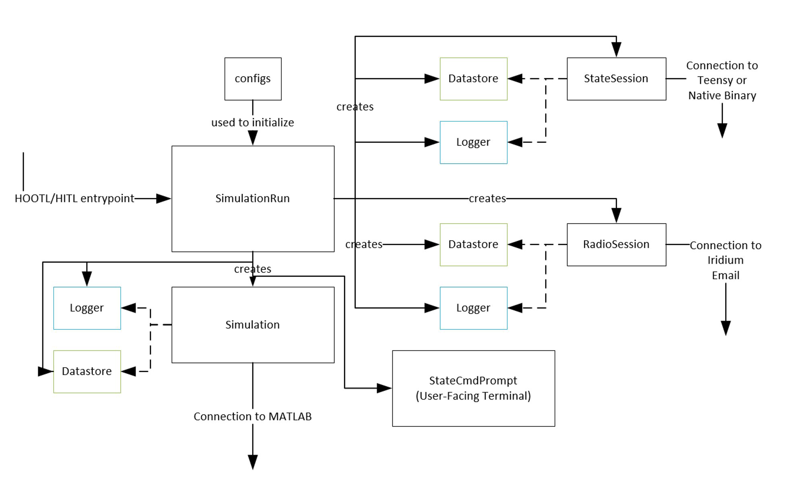

====================
Testing Architecture
====================

PAN has an extremely robust testing architecture that tests our flight software
in conjunction with our mission simulation in both a Hardware-out-of-the-Loop (HOOTL)
and Hardware-in-the-Loop (HITL) configuration. The HITL tests can be further broken
down into

 - Teensy-in-the-Loop (TITL) tests, which are like HOOTL tests but with flight
   software running on an actual Teensy 3.6, like it would on the satellite, rather
   than as a binary executable on a computer. 
 - Vehicle-in-the-Loop (VITL) tests, which run the flight software on the
   satellite's entire electronics stack. Optionally, VITL tests can incorporate
   other satellite elements like the propulsion system, the ADCS box, or the radio.

Flight software must be proven on HOOTL and TITL levels before running at a VITL level.
This testing architecture allows us to have iterated stages of proving the flight
readiness of software whilst minimizing risk to expensive hardware during testing.

Software Stack
==============

At the core of the simulation architecture is the **StateSession**. This is an integration
class that either connects to a Teensy running flight software or to a desktop binary executable,
and allows exchanging state fields with the flight software.

Related to the **StateSession** is the **RadioSession**, which creates a connection to the
email account that PAN uses to talk to the Iridium satellite network. Using this email account,
the **RadioSession** is able to interpret downlinks and send uplinks when requested by the
simulation.

At the top level, the **SimulationRun** architects the **Simulation**, any **StateSession**
objects, any **RadioSession** objects, the **StateCmdPrompt**, and **Datastore** and **Logger**
objects required by the state sessions, simulation, and radio session.
